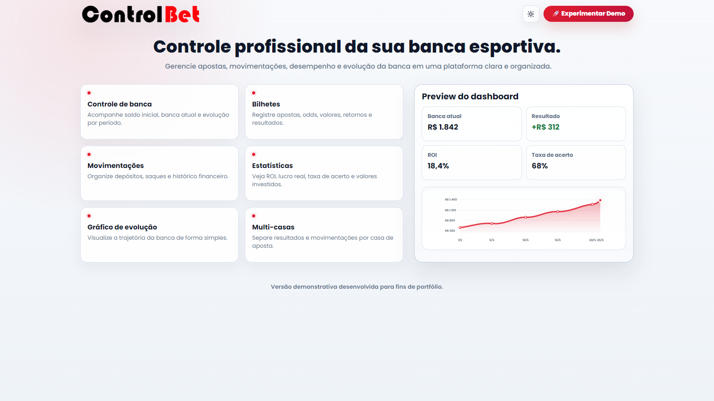
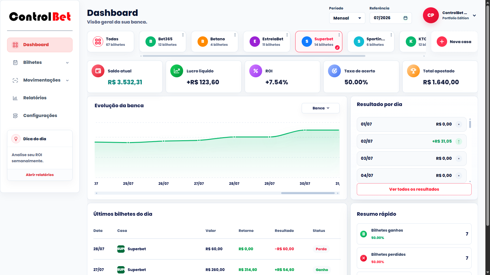
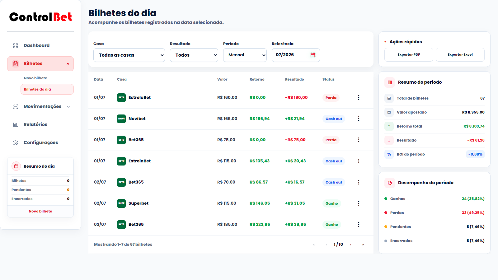
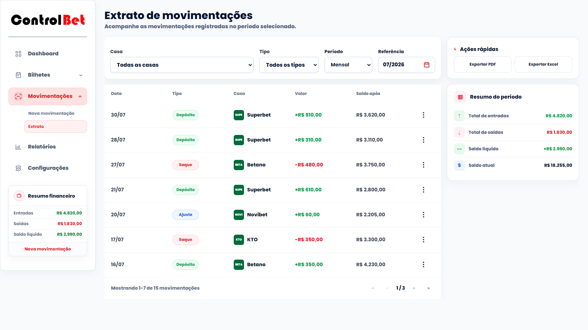
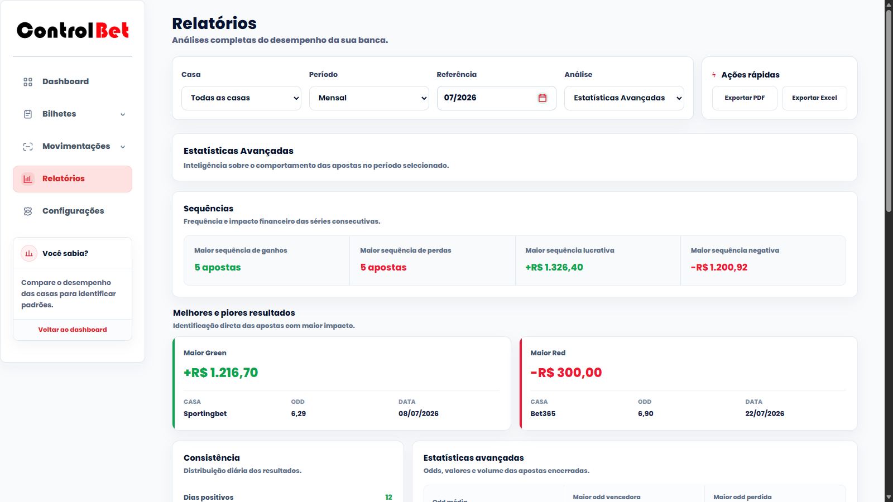

# 🎯 ControlBet

Sistema web próprio para gerenciamento e acompanhamento de uma banca esportiva.

O ControlBet foi criado a partir de uma necessidade real de centralizar registros, movimentações e resultados em uma única solução, permitindo acompanhar a evolução da banca e consultar informações para controle e análise.

Este repositório contém a versão pública demonstrativa do projeto.

<p align="center">
  <a href="https://controlbet-demo.vercel.app/">
    
  </a>
</p>

---

## 📌 Visão geral

O ControlBet permite centralizar informações relacionadas à operação da banca, incluindo:

- cadastro de casas de apostas;
- registro de bilhetes;
- movimentações financeiras;
- acompanhamento de resultados;
- evolução da banca;
- indicadores de desempenho;
- relatórios;
- filtros e consultas.

O projeto evoluiu de forma incremental, passando por ciclos de observação, definição, implementação, testes, correções e refinamento funcional.

---

## 🧠 Minha atuação no projeto

O principal objetivo do projeto não foi apenas construir uma aplicação, mas aplicar na prática conhecimentos relacionados à análise e evolução de sistemas.

Minha atuação envolveu:

- identificação e organização de necessidades;
- definição de requisitos funcionais;
- definição e revisão de regras de negócio;
- organização de fluxos e informações;
- definição de prioridades e escopo;
- realização de testes manuais;
- definição de critérios de aceite;
- validação dos comportamentos esperados;
- identificação de inconsistências;
- simplificação e refinamento de funcionalidades.

Essas atividades permaneceram sob minha responsabilidade durante a evolução funcional da solução.

### Implementação apoiada por Inteligência Artificial

A implementação técnica contou com o apoio de ferramentas de Inteligência Artificial.

As ferramentas foram utilizadas para auxiliar na implementação, revisão, identificação de problemas e evolução das funcionalidades. As propostas apresentadas eram analisadas, ajustadas ou descartadas antes do aceite.

O **OpenAI Codex** foi utilizado como uma das principais ferramentas de apoio técnico nas etapas mais recentes do projeto.

Um exemplo foi a proposta de criação de um plano Premium. A funcionalidade foi descartada por não fazer sentido para um sistema pessoal e sem objetivo comercial.

---

## 🔎 Decisões funcionais

A evolução do ControlBet envolveu decisões relacionadas ao comportamento esperado da solução.

### Proteger a banca

**Regra:** impedir apostas e saques superiores ao saldo disponível.

**Critério de aceite:** a operação deve ser bloqueada quando o valor ultrapassar o saldo disponível.

### Normalizar o retorno de bilhetes perdidos

**Regra:** ao marcar um bilhete como "Perdido", o retorno deve ser automaticamente redefinido para `R$ 0,00`.

**Critério de aceite:** a atualização deve ocorrer sem uma nova ação do usuário.

### Simplificar a seleção das casas

O filtro adicional utilizado anteriormente foi substituído pela seleção direta da casa nos próprios cards.

**Critério de aceite:** selecionar a casa diretamente no card, sem uma etapa intermediária.

Essas decisões mostram como o uso da aplicação e os testes contribuíram para identificar inconsistências e oportunidades de simplificação.

---

## ✨ Funcionalidades

- 📊 Dashboard com indicadores da banca
- 🏦 Cadastro e gerenciamento de casas de apostas
- 🎟️ Cadastro e gerenciamento de bilhetes
- 💰 Registro de depósitos, saques e outras movimentações
- 📈 Acompanhamento da evolução da banca
- 📉 Cálculo de resultados e indicadores de desempenho
- 📋 Relatórios gerais e estatísticas
- 🔎 Filtros por casa e período
- 📱 Interface adaptada para desktop e dispositivos móveis
- 💾 Persistência dos dados

---

## 🌐 Demo

Uma versão pública está disponível para permitir a exploração das principais funcionalidades diretamente pelo navegador.

### [Acessar ControlBet Demo](https://controlbet-demo.vercel.app/)

A Demo:

- não exige criação de conta;
- utiliza dados fictícios;
- permite cadastrar, editar e excluir informações;
- utiliza `localStorage` para persistência dos dados;
- funciona independentemente da infraestrutura da versão principal.

Os dados ficam armazenados apenas no navegador utilizado para acessar a aplicação.

A demonstração está atualmente direcionada para utilização em computadores desktop.

---

## 🧩 Versões do projeto

O ControlBet possui duas versões com objetivos diferentes.

| Versão | Características |
| --- | --- |
| **ControlBet** | Versão principal e privada, com autenticação, persistência online e integração com Supabase. |
| **ControlBet Demo** | Versão pública deste repositório, sem autenticação e com persistência local. |

A separação permite manter a aplicação principal em um ambiente privado enquanto uma versão funcional permanece disponível para demonstração.

---

## 📷 Interface

### Landing Page

Tela de apresentação da versão pública do ControlBet.

<p align="center">
  
</p>

### Dashboard

Visão geral da banca com indicadores, casas cadastradas, evolução do saldo e resultados.

<p align="center">
  
</p>

### Bilhetes

Registro e acompanhamento das apostas realizadas.

<p align="center">
  
</p>

### Movimentações

Controle de depósitos, saques e histórico financeiro.

<p align="center">
  
</p>

### Relatórios

Visualização de resultados, indicadores e estatísticas do período selecionado.

<p align="center">
  
</p>

---

## 🛠️ Tecnologias utilizadas

<p align="center">
  
  
  
  
  
  
  
  
</p>

**Principais tecnologias e ferramentas:**

- **React** para construção da interface
- **Vite** como ferramenta de desenvolvimento e build
- **JavaScript**
- **HTML e CSS**
- **React Router** para navegação
- **Supabase** na versão principal para autenticação e persistência dos dados
- **localStorage** na versão Demo para armazenamento local
- **Git e GitHub** para controle de versão
- **Vercel** para publicação
- **OpenAI Codex** como ferramenta de apoio à implementação técnica

---

## 📚 Evolução do projeto

O ControlBet foi desenvolvido de forma incremental.

O sistema começou com uma estrutura básica de gerenciamento da banca e evoluiu conforme os fluxos eram utilizados, testados e analisados.

Durante esse processo, foram trabalhados:

- organização da interface;
- definição e revisão de regras de negócio;
- estruturação de fluxos;
- cálculos financeiros e indicadores;
- persistência e sincronização de dados;
- autenticação na versão principal;
- relatórios e visualização de informações;
- testes manuais;
- correção de inconsistências;
- simplificação de funcionalidades;
- evolução da experiência de uso.

O ciclo principal do desenvolvimento foi concluído com uma solução funcional para o objetivo atual do projeto.

---

## 📊 Resultados e aprendizados

A evolução do projeto permitiu:

- centralizar o registro das operações;
- utilizar o sistema em situações reais desde as primeiras versões;
- refinar regras e fluxos a partir do uso;
- identificar inconsistências por meio de testes manuais;
- perceber a importância da consistência dos dados de origem para os indicadores;
- compreender que remover funcionalidades também pode melhorar uma solução;
- utilizar critérios de aceite para validar comportamentos esperados.

---

## ⚠️ Limites do projeto

O ControlBet é um projeto individual, de uso pessoal e sem operação comercial.

Por isso, o projeto não representa:

- pesquisa formal com usuários externos;
- testes automatizados;
- validação técnica de segurança;
- operação de um sistema comercial;
- experiência profissional formal como Analista de Sistemas.

A implementação técnica também contou com assistência de Inteligência Artificial, conforme descrito neste README.

---

## 💻 Executando localmente

### Pré-requisitos

É necessário ter o **Node.js** e o **Git** instalados.

Clone o repositório:

```bash
git clone https://github.com/regesalves/controlbet-demo.git
